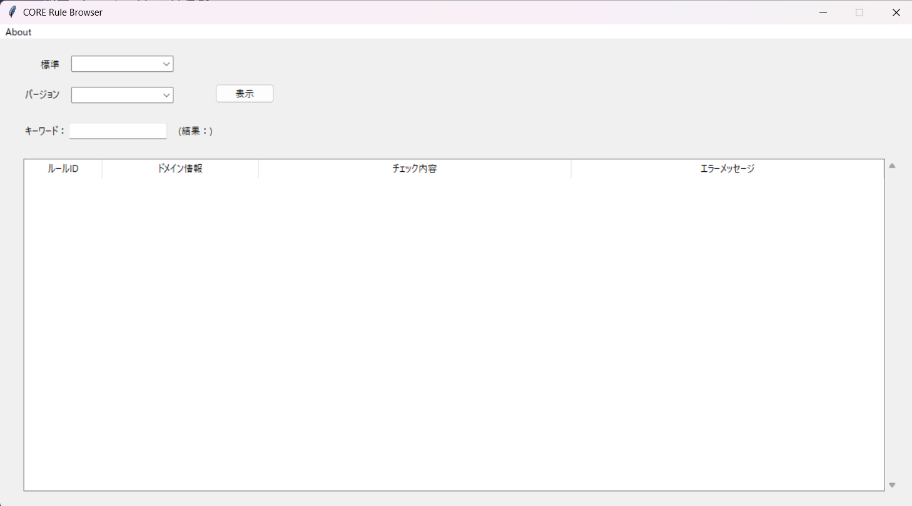
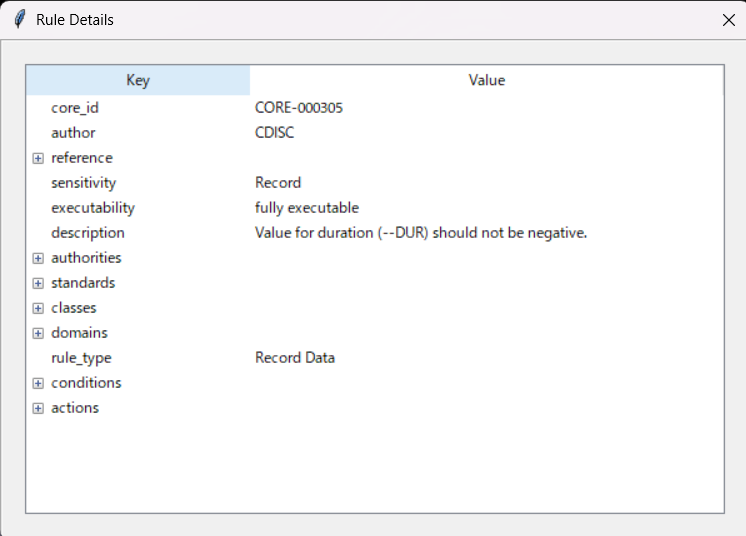

# CDISC-CORE-Rule-Browser

English Page is here [README.md](https://github.com/HajimeShimizu/CDISC-CORE-Rule-Browser/blob/main/README.md).

## 概要
CDISCは[CDISC Open Rules Engine (CORE)](https://github.com/cdisc-org/cdisc-rules-engine)を開発しています。このツールで、CDISC標準を利用した成果物の妥当性をチェックできます。COREではたくさんのルールが実行されますが、ルールの詳細を簡単に確認することができません。CDISC CORE Rule Browserは、関心のあるチェックルールがCORE内でどのように実装されているかを確認するツールです。

## ダウンロード
リリースページ（[こちら](https://github.com/HajimeShimizu/CDISC-CORE-Rule-Browser/releases)）よりダウンロードできます。実行ファイルのみのダウンロードで十分です

## セットアップ方法
- このツールはCOREのキャッシュフォルダにあるルール一覧ファイルの内部を表示するものです
- /resources/cacheフォルダ内にルール一覧のファイルが必要となります
- こちらの[ページ](https://note.com/cdisc/n/n2e23f6e1dad1)でも紹介していますので、必要に応じて確認してください。

## 使い方
ツールの実行ファイルをダブルクリックすることで起動します。\
\

### パラメータの指定
- 標準：COREのルールを確認したい標準を選びます
- バージョン：確認したい標準のバージョンを選びます

上記を指定後、「表示」ボタンを押してください

### ルールの検索
ルールはランダムな順番で表示されます（※意味のある順番にソートすることができません）。実際的には、リストされた一覧から関心のあるルールを検索することになります。検索ボックスにキーワードを入れ、リターンキーを押すことで、データが絞り込まれます。キーワードが空の状態でリターンキーを押すと、最初の検索結果が表示されます。

検索のヒント
- ドメイン名の指定は非現実的です。変数名など、別の条件を指定しましょう

### ルールの詳細
初期状態では、ルールのID・チェックの概要・エラーメッセージのみが表示されています。さらに詳しい情報を知りたい場合、任意のルールをダブルクリックします（ロジック部分の解読は難しいため、別途解説を用意する予定です）。

