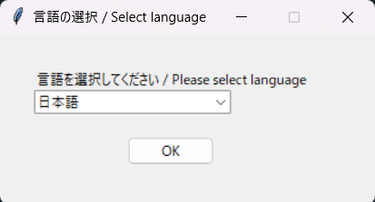

# CDISC-CORE-Rule-Browser

English Page is here [README.md](https://github.com/HajimeShimizu/CDISC-CORE-Rule-Browser/blob/main/README.md).

## 概要
CDISCは[CDISC Open Rules Engine (CORE)](https://github.com/cdisc-org/cdisc-rules-engine)を開発しています。このツールで、CDISC標準を利用した成果物の妥当性をチェックできます。COREではたくさんのルールが実行されますが、ルールの詳細を簡単に確認することができません。CDISC CORE Rule Browserは、関心のあるチェックルールがCORE内でどのように実装されているかを確認するツールです。具体的には、COREのキャッシュフォルダにあるルール一覧ファイルの内部を表示します。

## ダウンロード
リリースページ（[こちら](https://github.com/HajimeShimizu/CDISC-CORE-Rule-Browser/releases)）よりダウンロードできます。本ファイル以外にCOREのキャッシュファイルを適切なフォルダに格納する必要があります。

## セットアップ方法
1. ダウンロードした圧縮ファイルを展開します
2. 別途、COREをダウンロードしたフォルダに、展開したファイル・フォルダを保存します
  - 本ツールは /resources/cacheフォルダ内にルール一覧のファイルが必要となります
  - 一般的には、COREのトップレベルにツールをおくことになります
  - こちらの[ページ](https://note.com/cdisc/n/n2e23f6e1dad1)でも紹介していますので、必要に応じて確認してください

## 使い方
ツールの実行ファイルをダブルクリックすることで起動します。
最初に言語を選択してください。

「OK」ボタンを押すと、ツールが起動します。

### パラメータの指定
- 標準：COREのルールを確認したい標準を選びます
- バージョン：確認したい標準のバージョンを選びます

上記を指定後、「表示」ボタンを押してください

### ルールの検索
ルールはランダムな順番で表示されます（※意味のある順番にソートすることができません）。実際的には、リストされた一覧から関心のあるルールを検索することになります。検索ボックスにキーワードを入れ、リターンキーを押すことで、データが絞り込まれます。キーワードが空の状態でリターンキーを押すと、元の状態（最初の検索結果）に戻ります。

検索のヒント
- ドメイン名の指定は非現実的です。変数名など、別の条件を指定しましょう

### ルールの詳細
初期状態では、ルールのID・ドメイン情報・チェックの概要・エラーメッセージのみが表示されています。さらに詳しい情報を知りたい場合、任意のルールをダブルクリックします（ロジック部分の解読は難しいため、別途解説を用意する予定です）。

