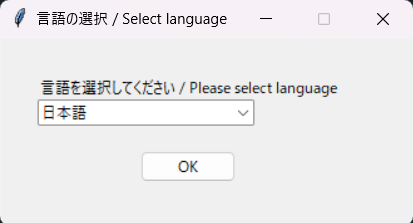
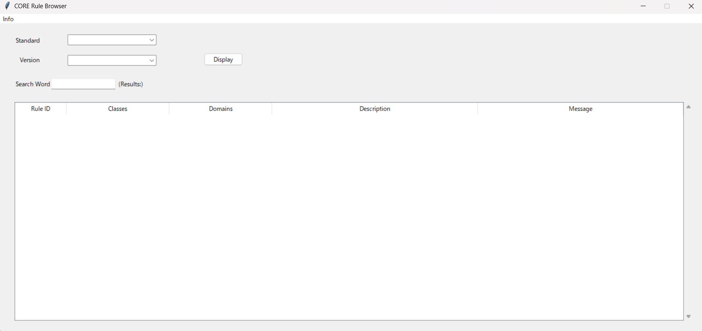

# CDISC-CORE-Rule-Browser

日本語ページはこちら [README-ja.md](https://github.com/HajimeShimizu/CDISC-CORE-Rule-Browser/blob/main/README-ja.md).

## Overview
CDISC is developing [CDISC Open Rules Engine (CORE)](https://github.com/cdisc-org/cdisc-rules-engine). This tool enables users to validate their deliverables based on CDISC standards. In CORE, many rules are executed, but the details of each rules are not open to general users. This tool lists all rules for specific standard and specific version and allows users to drill down details of each rule. This tool refers cache files of CORE.

## Download
Visit release page（[Here](https://github.com/HajimeShimizu/CDISC-CORE-Rule-Browser/releases)）. In addition to this tool, rule cache file created by CORE is required.

## How to set up
1. Download package and extract all components.
2. Place all files/folders to CORE package (you need to download CORE).
- Cache file should be located at folder "/resources/cache"
- In general, you would place downloaded files at the top level folder of CORE.
- More guide is found in this [page](https://note.com/cdisc/n/n2e23f6e1dad1).

## How to use
Tool is booted by double clicking .exe file. Choose language and Press OK.

By cliking OK button, tool is ready for use.

### Paramters
- Standard：Select standard
- Version：Select version

Press "display" button after specifying all parameters.

### Filter
Rules are listed at random order (Note: No meaningfull order of conformance rules). Practically, users will filter rules in interest by themselve. Type key words in search box. By hitting enter key, filtering is executed. By specifying empty as key words, all rules shows up (equal to result of standard/version selection).

Hints for filtering
- Domain name may not work as you expect (please notify "ALL"). Any other chocies are recommended.

### Look into the details of rule
Rule ID, class, domain, overall description and error meesage are listed. By double clicking rule, details are shown in pop up window.

